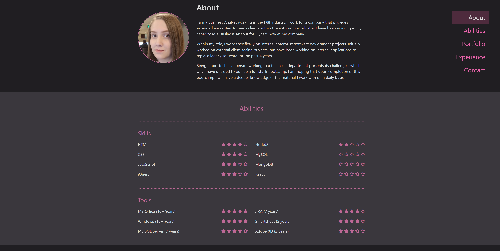

# Homework Assignment 8: Updated Portfolio

## Description

The purpose of this assignment is to update and personalize the previously created portfolio site.  The portfolio site should contain biographical and contact information, as well as a portfolio section with examples from previous work.  

---
## Usage

To view the live site click [here](https://ewells89.github.io/elyse-wells-portfolio/).

To access a copy of the repository for local use:
* Download a copy of the repository by performing a git pull onto your local machine.
* Open the html file in your browser to view the page.
* Otherwise, open the repository using your preferred IDE.

---
## Credits

### Individuals:
* Ga Tech Boot Camp Class

---

## Sources/Tutorials
* CSS/Bootstrap
* FontAwesome

---
## License

Copyright (c) 2020 Elyse Wells

Permission is hereby granted, free of charge, to any person obtaining a copy
of this software and associated documentation files (the "Software"), to deal
in the Software without restriction, including without limitation the rights
to use, copy, modify, merge, publish, distribute, sublicense, and/or sell
copies of the Software, and to permit persons to whom the Software is
furnished to do so, subject to the following conditions:

The above copyright notice and this permission notice shall be included in all
copies or substantial portions of the Software.

THE SOFTWARE IS PROVIDED "AS IS", WITHOUT WARRANTY OF ANY KIND, EXPRESS OR
IMPLIED, INCLUDING BUT NOT LIMITED TO THE WARRANTIES OF MERCHANTABILITY,
FITNESS FOR A PARTICULAR PURPOSE AND NONINFRINGEMENT. IN NO EVENT SHALL THE
AUTHORS OR COPYRIGHT HOLDERS BE LIABLE FOR ANY CLAIM, DAMAGES OR OTHER
LIABILITY, WHETHER IN AN ACTION OF CONTRACT, TORT OR OTHERWISE, ARISING FROM,
OUT OF OR IN CONNECTION WITH THE SOFTWARE OR THE USE OR OTHER DEALINGS IN THE
SOFTWARE.

---